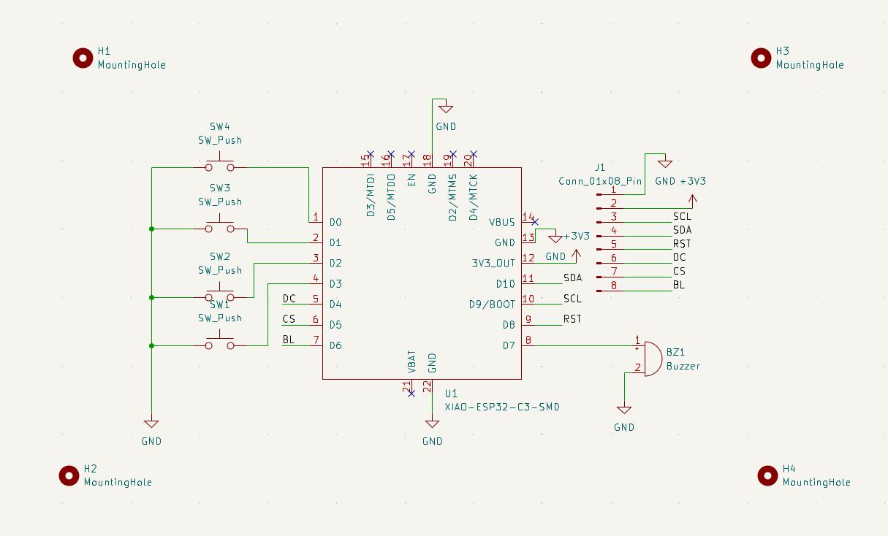
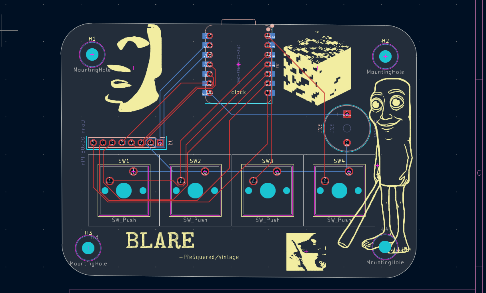
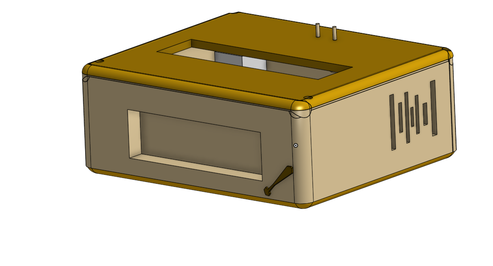
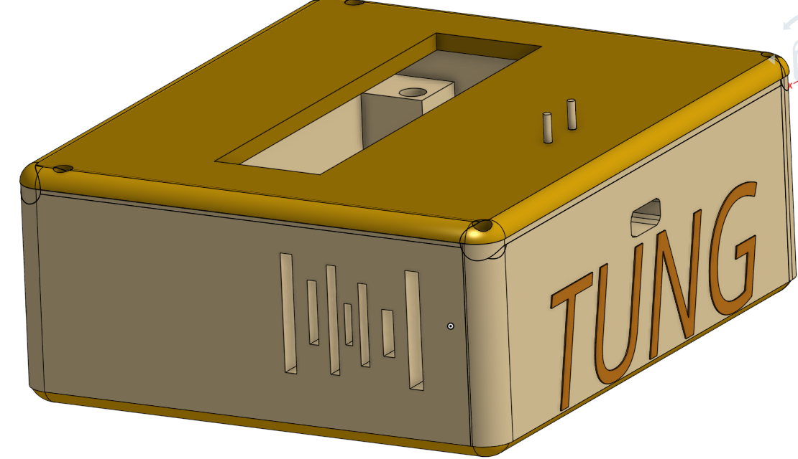
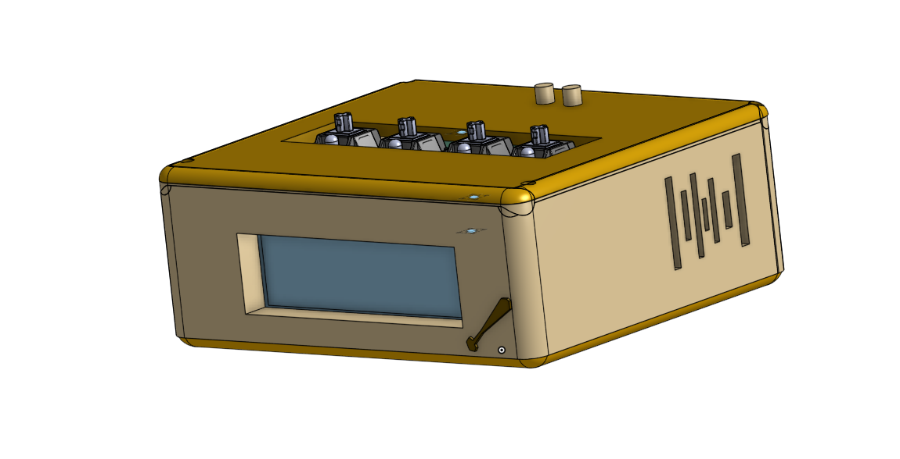

# Tung Tung Tung sa Board (TTTsaboard)
Tung Tung Tung sa Board is one of the best alarm clocks out there for the _not so_ ordinary consumers! It has 4 keys on the top that is powered by a ESP32 with a 2.25in screen.
Its a pretty cool clock I would say and does what any other clock does, but better.

##Features

- An alarm
- Custom PCB
- Arduino board so you can easily edit the FW
- Portable
- Allows for custom figures on the top (Comes with trippleT omg omg!!!)

### Schematic

### PCB

### Case

### Built Model

# Usage

1. Get [Arduino IDE](https://www.arduino.cc/en/software/)
2. Flash the Firmware in the **Firmware** folder

# AI USE

Google search ai was used in order to understand tools i am unfamiliar with and understanding the C++/Arduino syntax

